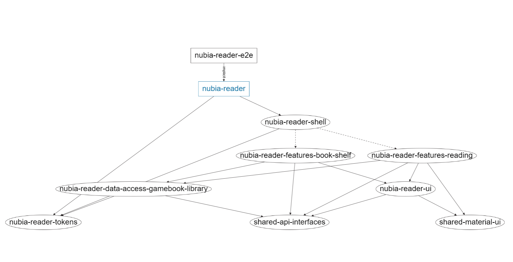
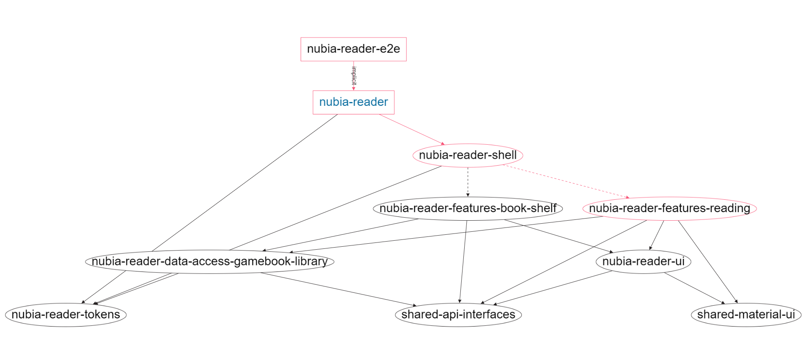
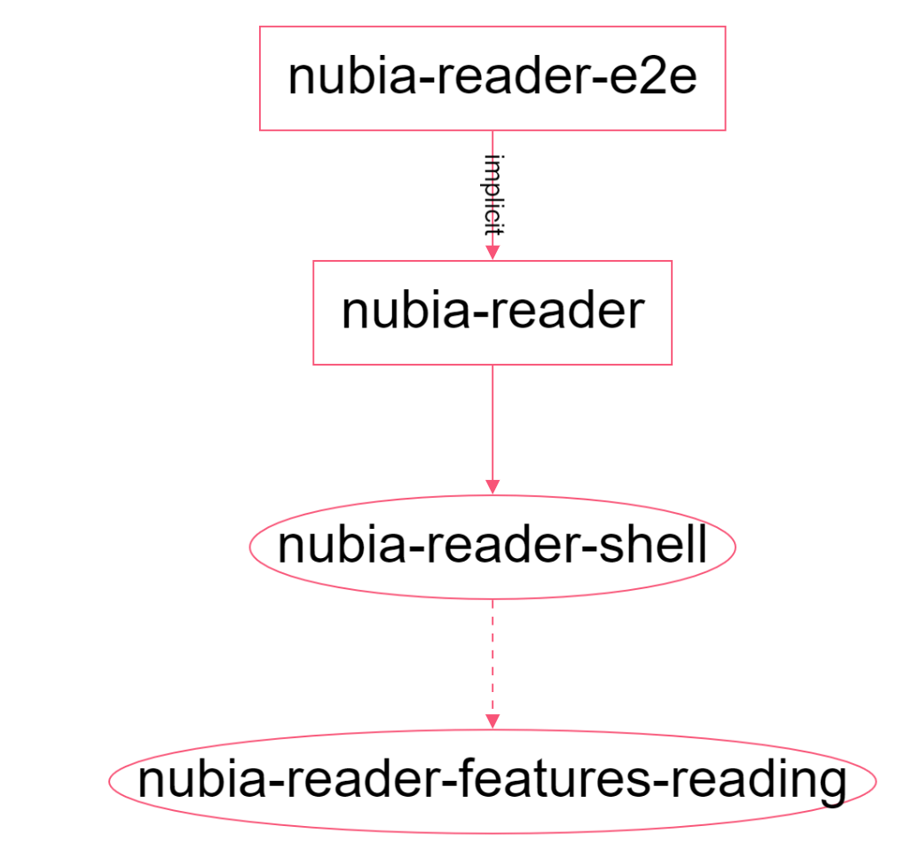
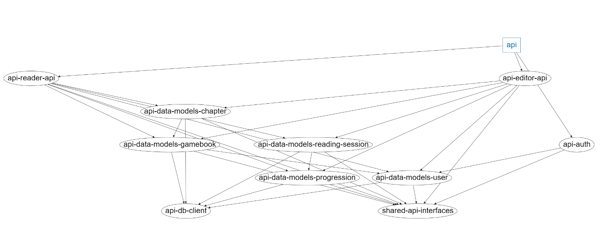
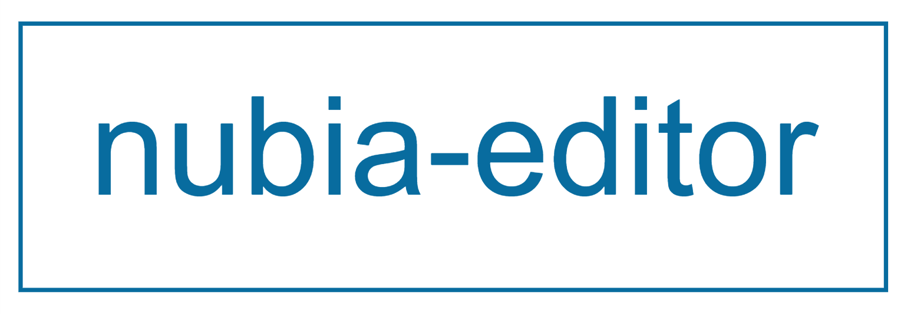

Most of my stream and video time is going to be working on a specific project, Nubia Gamebooks (or just Nubia for short). As such I want to take some time to talk about this project a bit more in-depth then I might during a stream or video, and go into the technology and decisions I made.

## What are gamebooks?

Before I can talk about Nubia, we need to be on the same page about what a gamebook is. A gamebook is a story where the reader can make a choice about what they want to do next. Once they've made that choice, the story branches down different paths in response to that choice, giving them a different story experience than another reader that made a different choice. Examples of gamebooks are: the [Choose-your-own-adventures](https://www.cyoa.com/) series of books, many visual novels, and [tabletop rpg solo gamebooks](https://www.dmsguild.com/browse.php?author=5E%20Solo%20Gamebooks).

## What is Nubia Gamebooks?

Nubia Gamebooks is a platform to allow people to read/write gamebooks. The original inspiration for Nubia came while I was going through [The Death Knight's Squire](https://www.dmsguild.com/product/220997/DD-Solo-Adventure-The-Death-Knights-Squire) (a D&D Solo Gamebook). These gamebooks are structured as PDFs with options at the end of blocks that link you to new blocks. While going through the gamebook, the pdf structure allowed me to see other parts in the story that were not relevant to what I was doing at that moment. That means I had to pay extra attention to prevent getting spoiled by something that might happen later on. I couldn't help but wonder, what if I could go through an adventure like this, but in an online e-reader instead, that only showed me the current block, and would go to the next block for me. That is the purpose of Nubia.

## The Tech

But enough about the non-technicals, how is Nubia getting built?

### Code Structure

The Nubia project is a [Nrwl Nx](https://nx.dev/) workspace with different applications/libraries in the same monorepo. The actual code in this workspace is split up into libraries (usually modules but not always), leading to *very* small applications that serve only to call a shell library, which itself is a composition of other libraries. I came across this structure from [Trung Vo](https://gist.github.com/trungk18) who describes it more in depth in his [Nx workspace structure for NestJs and Angular](https://gist.github.com/trungk18/7ef8766cafc05bc8fd87be22de6c5b12) gist, but I'll summarize the main benefits I'm interested in here.

Nx makes use of libraries, and other app/library dependencies on those, to generate a dependency graph showing what is used by different parts of your application.

Here's an example of the dependency graph for the Nubia Reader, one of the applications in this workspace.

The actual application is the blue highlighted block and is responsible for very little, except taking in environment variables and injection tokens, importing the reader shell, and injecting some specific values from the environment (such as the API URL). This means that in the future, if I wanted to build another version of this application, with slightly different logic, I can just create a new small application, inject whatever is appropriate, and build it, without having code duplication between both applications.

Nx also tracks what applications/libraries need to be tested due to code changes. If all of the code for an application, was written inside that single application, that means any change to the application would require re-running all tests on the application, even tests for unaffected areas.
At some point while flushing out the reading module I added a button at the very end of a gamebooks that would take the reader to a page showing all of the choices they made while reading that gamebook. While I do want that functionality at some point, it's not something I'm going to care about having right away, so as it stands it's a button that doesn't do anything. I went in a commented out that button so it's no longer visible. Here's that same dependency graph, but notice this time, the reader module is circled red, as is everything that depends on it.

If everything was coded in a single project (either with or without Nx), if I were to run a test right now on my application, I would have to run all of my tests. With Nx, and with this splitting, I can instead only run tests on the red subset of the application.

I won't spend too much more time on this structure (I would welcome you to look the original [gist](https://gist.github.com/trungk18/7ef8766cafc05bc8fd87be22de6c5b12) if you want more information about it), but I want to point out that this project is my first time using this structure, and my first time using Nx for more then just a few hours on a random sunday afternoon. As such, mistakes will be made, especially on stream. The more this project is developed, the better my understanding will become, and the more I'll be able to go back and refactor those areas.

### The API Backend

#### Why not microservices?

It's been a month since the last stream. This is for a few different reasons (including some upgrades to prevent OBS and VS Code from crashing whenever I saved a file), but one of the reasons is because I dove down the microservices rabbit hole. If you ever look at the [microservice](https://github.com/nick-freitas/nubia/tree/microservices) branch on github you'll see the aftermath that docker, kubernetes, and kafka had on Nubia. While I truly enjoyed coding in that environment, I unfortunately ran into numerous configuration issues that took too long to solve. The end result was me spending an week or more trying to fix a problem, only to have to find a workaround because I could not get it to work. I do plan on going back to microservices in general (when I figure out how I broke the Nginx Ingress Controller after three weeks of no issues and how to finally deploy multiple kafka brokers), but whether or not I'll refactor Nubia to also will depend on the pros vs cons of doing so when that time comes. In the meantime, Nubia will be a monolith architecture. So much so, that the current branch is still `old-monolith`. I might get around to merging it back into `master` at some point, but for now it'll be reminder on the bottom left of my vs code screen to not let my k8s cluster get too lonely.

#### A single Nest.js API

The Nubia Api right now is a single API built with [Nest.js](https://nestjs.com/) with two modules, one for the reader and one for the editor. This is giving me two different endpoints (`/reader-api/` and `/editor-api`) which is not ideal. The goal is to have everything working off of a singular `/api/`. I have the api working for the reader application with this setup however, and the easiest way to get the editor application integrated with the project as a whole, is by having a seperate api endpoint for it also. Once I have a basic store application working, api endpoint refactoring will come back into play. 

Like the Reader application briefly described above, the API follows the same splitting pattern, having a very small application, with different libraries. This is the API's Dependency Graph.

The API application consumes 2 libraries/modules (3 including the auth module which is a work in progress for a later time). Those modules in turn consume the different models depending on what they need to do. The data models then consume the DB Client so only data models can calls to the db.

#### Prisma/PostgreSql

I'm using [Prisma](https://www.prisma.io/) as the ORM, and [PostgreSQL](https://www.postgresql.org/) as the database. While the majority of my experience comes from using Microsoft's SQL Server, that is less of a choice when looking for free solutions that work on a linux environment. Additionally, I wanted to give Prisma a try mainly due to Prisma Studio (the database browser), and PostgreSQL is the default database supported by them.

#### Authentication (or lack thereof...)

There is currently no authentication/authorization in the editor/reader. Instead any call to the API is given the user with id 1. While this is great for getting the frontend applications working, and making sure requests are doing what I want them to do, it's not what's going to be in the final application. Instead, the final application will use JWT tokens when sending API requests. Those tokens will be stored and sent through using cookies 🍪.

### Reader Application (Angular)

The Reader Application is built in [Angular](https://angular.io/), uses [NgRx Data](https://ngrx.io/guide/data) to store state and send api requests, and the UI is built using [Angular Material](https://material.angular.io/). It currently contains two main features: a bookshelf showing user's their library of gamebooks, and a reader that allows users to read a gamebook and track their reading session.
The reader's dependency graph is the same one used in the code structure example
.

### Editor Application (React)

The Editor Application is built in [React](https://reactjs.org/). Unlike the previous 2 applications that I started this summer, I originally built most of the editor in the beginning of the year to give React a try. I've been regularly working with Angular since 2016, and Angular.js before that, and wanted to give React a try to try something new. Since this application was written standalone months before I even created the Nx Workspace, it does not follow the same structure as the reader or api. Its dependency is itself and nothing else. While I do plan on breaking it out into seperate libraries/modules in the future, right now the goal is to get it fully integrated and working with the API.
.

The Editor is written in [Typescript](https://www.typescriptlang.org/) like the rest of the project. It uses [Redux](https://redux.js.org/) for storing state, [React Router](https://reactrouter.com/) for routing, [Formik](https://formik.org/) for Form Control, and [Material UI](https://material-ui.com/) for the UI.